# A bit about me

- .hlb[B.Sc. in Mathematics]: University of Valencia (UV). 2008 - 2013.

--

- .hlb[M.Sc. in Biostatistics]: UV. 2013 - 2015.

--

- .hlb[Ph.D. in Statistics and Optimization]:
  - Valencian Institute for Agricultural Research (IVIA). 2014 - 2016
  - UV. 2016 - 2019
  
--

- .hlb[Postdoctoral fellow]
  - Basque Center For applied Mathematics. 2019 - 2021

--

- .hlb[Lecturer] 
  - Departament of Applied Statistics and Operations Research and quality. Universitat Politècnica de València (UPV). 2021 - 

---

class: inverse, center, middle, animated, slideInRight

# Bayesian Spatio-temporal modeling

## Applications 

---
# Kakhi in Valencian Community
* Collaborative work with .hlb[IVIA] (Valencian Institute for Agricultural Research) .hlb[UV] (University of Valencia)
.center[
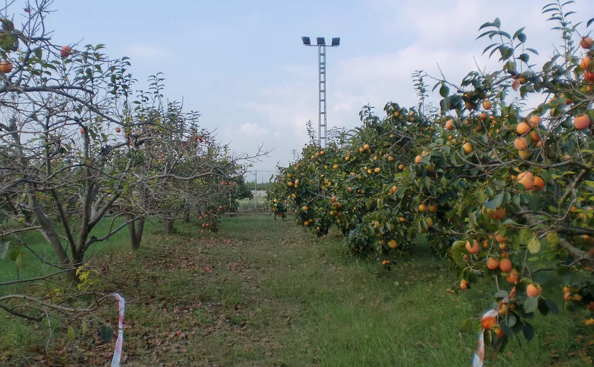]
---

# Kakhi in Valencian Community. Ascospores proportion
.center[
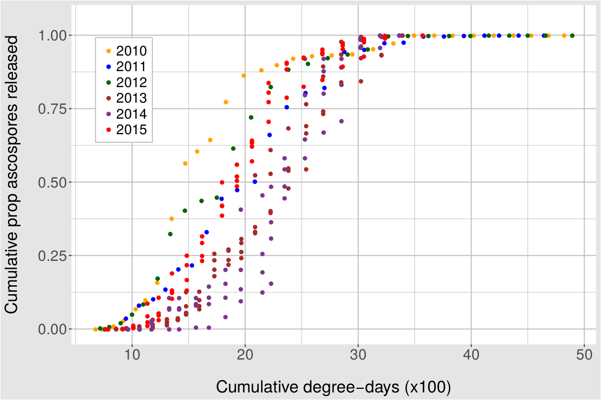]
---

# Kakhi in Valencian Community. Objective
.center[
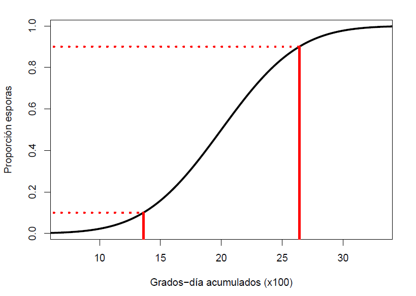]
---

# Kakhi in Valencian Community. Model
.center[
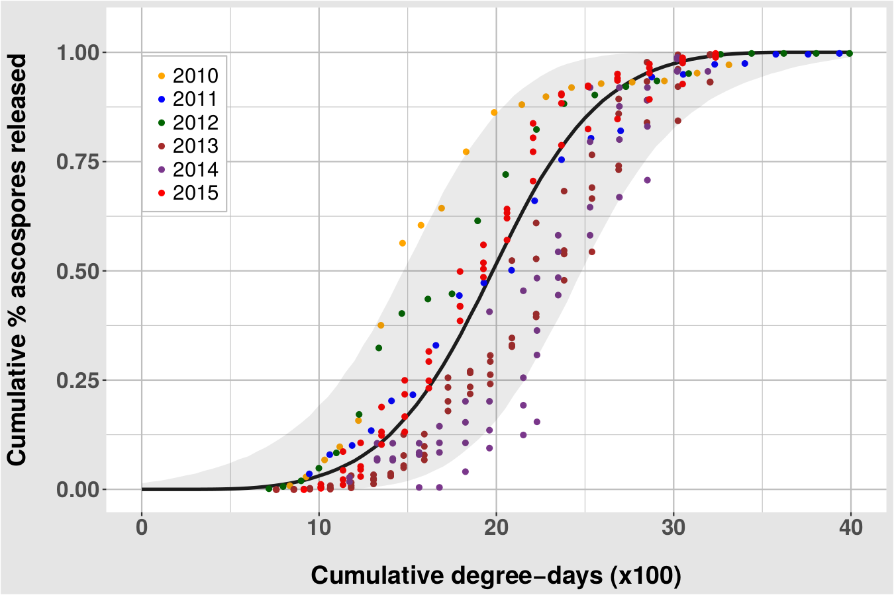
]
---

# Kakhi in Valencian Community. Webpage
.center[
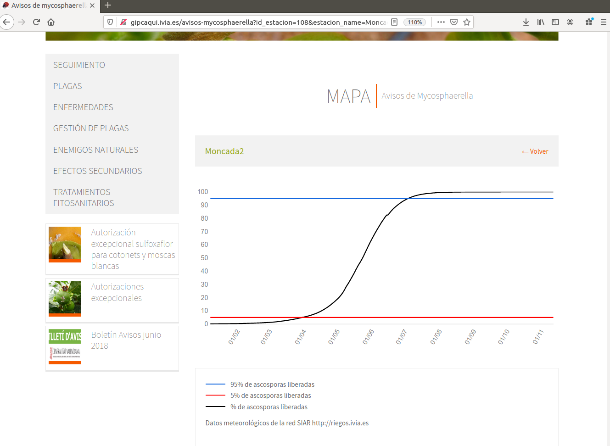]
---

# Dolphins in Sardinia
* Collaborative work with .hlb[IEO] (Spanish Institute of Oceanography) and .hlb[UV]
.center[
]
---

# Dolphins in Sardinia. Presence/Absence of dolphins
.center[
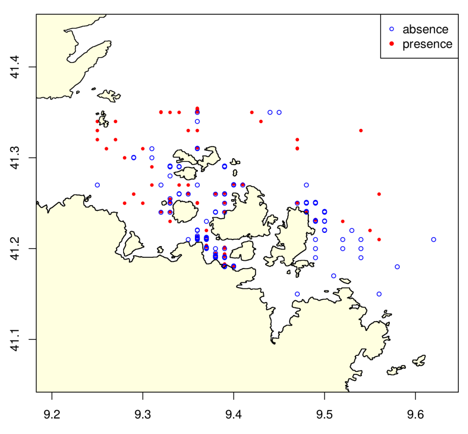]
---

# Dolphins in Sardinia. Model prediction
.center[
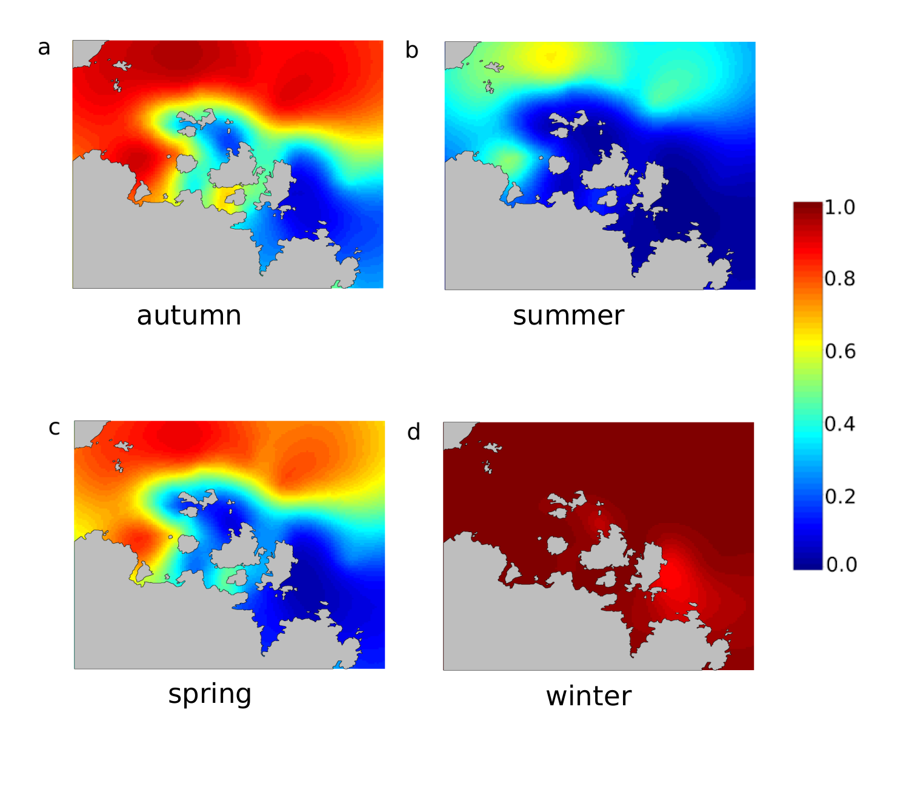]
---
# Pollution in the Basque Country: PM10 particles
* Collaborative work with .hlb[BCAM] (Basque Center for Applied Mathematics) and .hlb[Osakidetza]

* Projects: PID2020-115882RB-I00 and BMTF-Modelización Matemática Aplicada a Salud
.center[
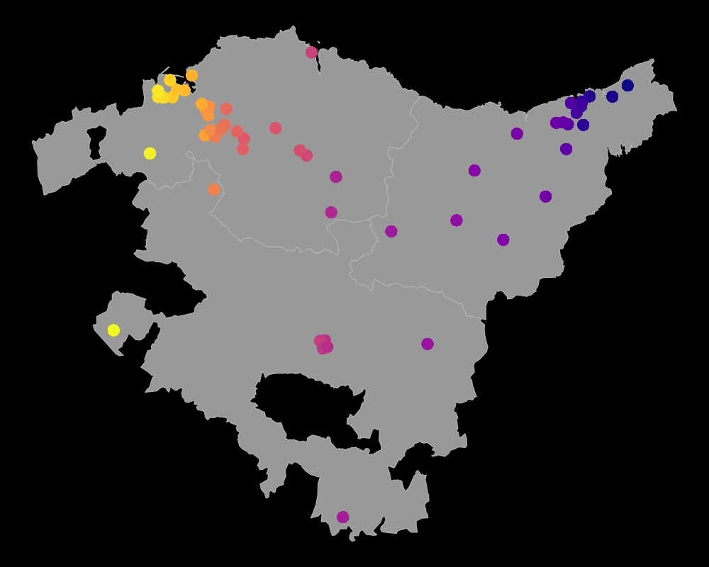]
---

# Pollution in the Basque Country: PM10 particles
.left-column2[
]

.right-column2[
]
---

class: inverse, center, middle, animated, slideInRight

# Bayesian Spatio-temporal modeling

## Compositional data (CoDa)
---
# Dirichlet regression using INLA: dirinla
* Collaborative work with .hlb[University of Edinburgh] and .hlb[UV]
.center[
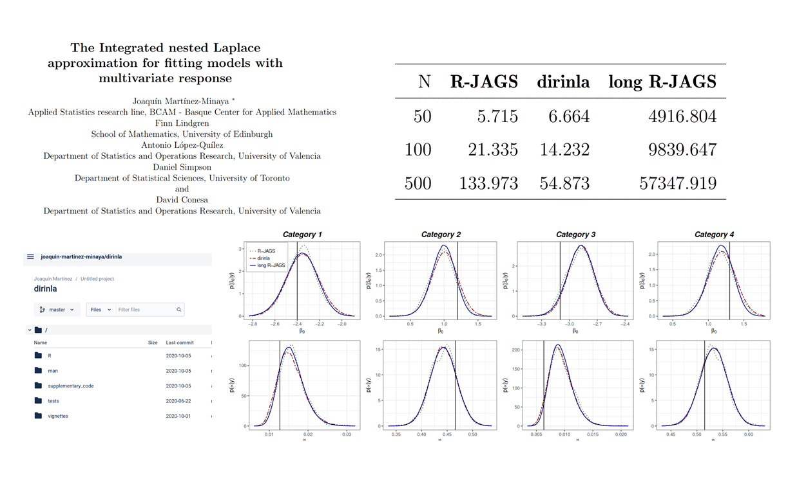]

---
# CoDa using stan
* Collaborative work with .hlb[BCAM]. Project: PID2020-115882RB-I00
.center[
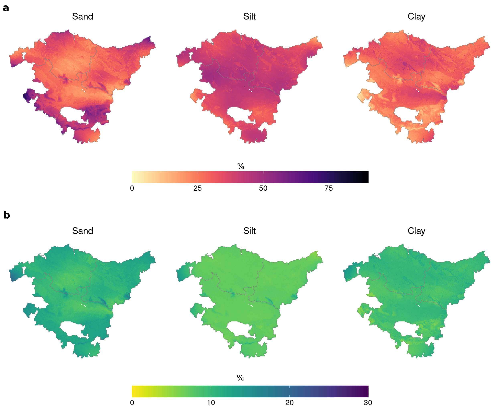]

---
# CoDa using stan
.center[
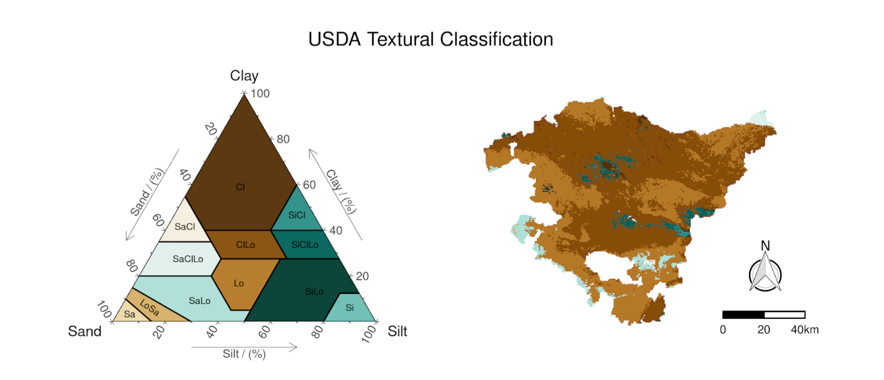]
---

# CoDa using INLA
.left-column2[

* Collaborative work with .hlb[KAUST] (King Abdullah University of Science and Technology)
]

.right-column2[
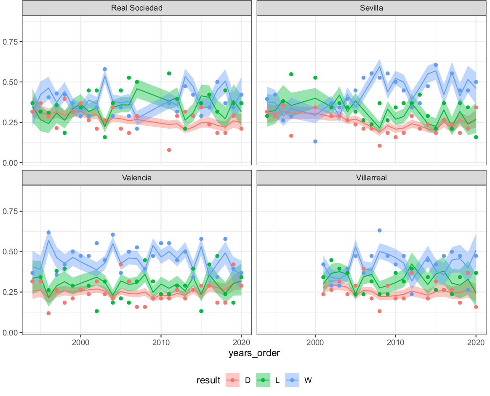]

---

class: inverse, center, middle, animated, slideInRight

# Bayesian Spatio-temporal modeling

## Metamodels
---
# Metamodels in Climate Change
* Collaborative work with .hlb[BCAM] and .hlb[UV]. `BayesVarSel`

.center[
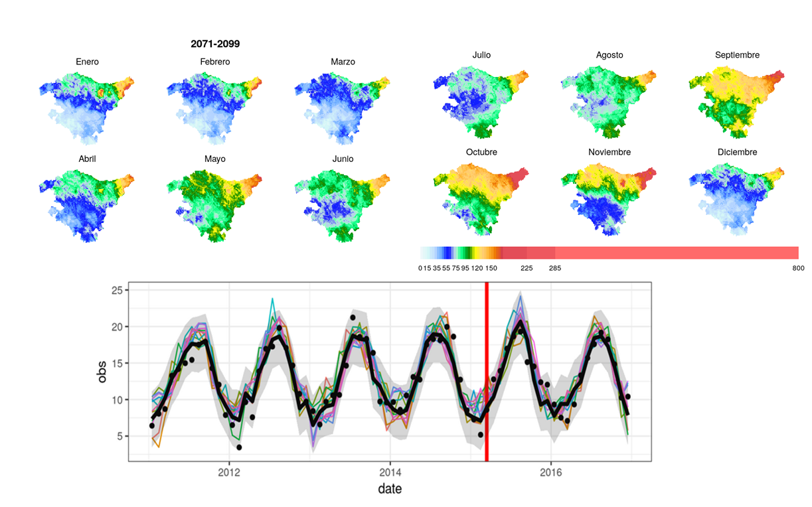]

---
class: inverse, center, middle, animated, bounceInDown

# Let's go!

