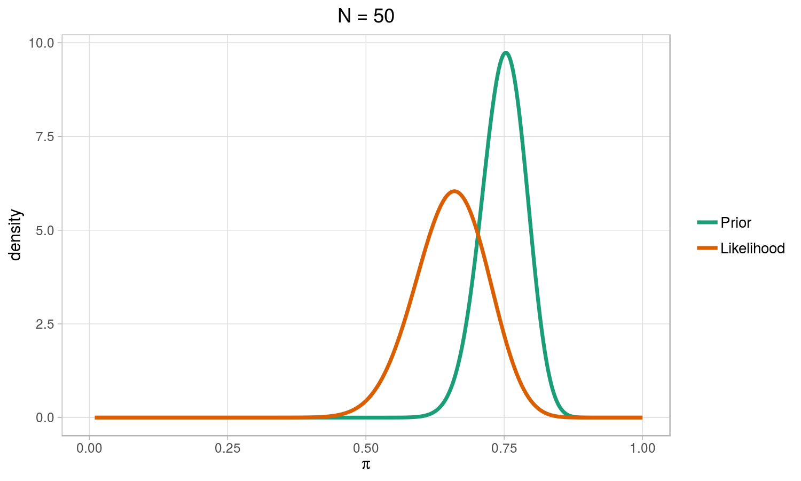
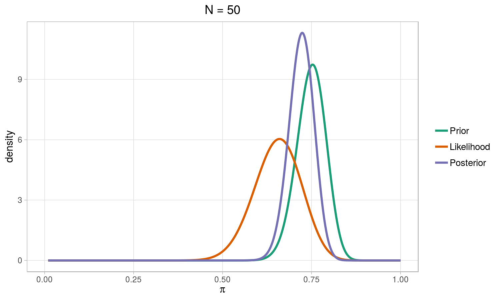
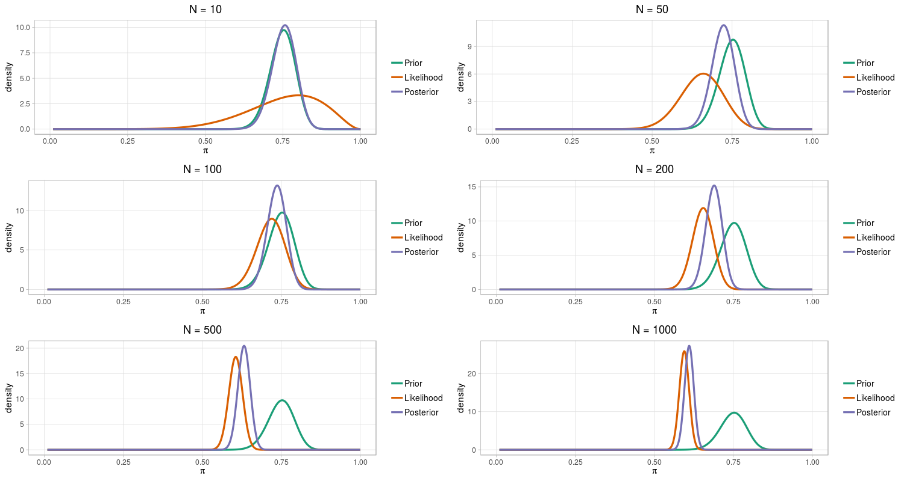
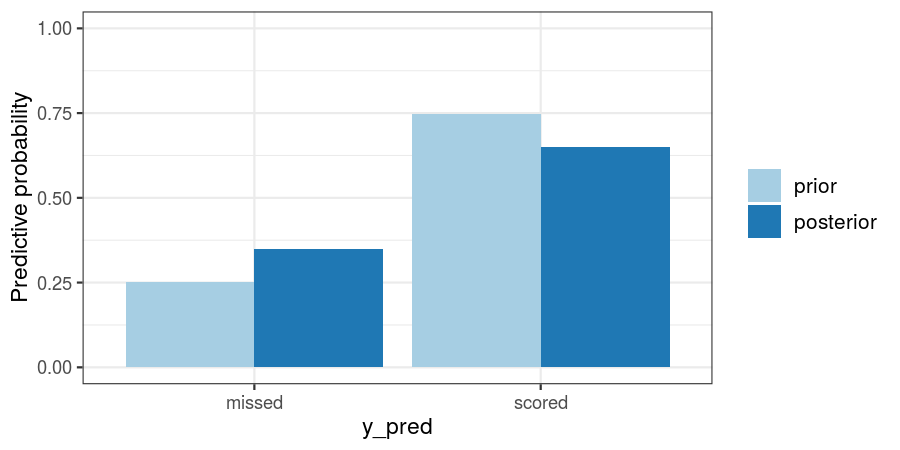
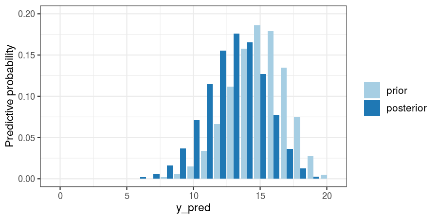

#Outline

## 1. What is Bayesian statistics? 

## 2. Doing inference on the parameters

## 3. Predictions

## 4. Hierarchical Bayesian models

---

class: inverse, center, middle, animated, slideInRight

# 1. What is Bayesian statistics?

---
# Basics of Bayesian Statistics
  -  Bayesian approach is another .hlb[way of understanding and doing Statistics]. 

--

  - It is .hlbred[NOT another field] inside Statistics (like spatial statistics or time series analysis).

--

  -  Therefore, when using Statistics to solve a problem (to make inference and prediction about the unknown parameters of the proposed model) we could do it using the .hlb[frequentist or Bayesian approach].

--

  -  The most known approach is the .hlb[frequentist]: a.k.a. classical (as it is the usual way to perform estimation, hypothesis testing and prediction of the parameters or each function of them).

---

# Fundamentals of the Bayesian approach

Reasoning in terms of probability

- about the observed in the sampling: data

- ... but ALSO about the unknown and unobserved: parameters

--

- .hlb[UNCERTAINTY] $\equiv$ .hlb[PROBABILITY] 

--

We express our knowledge about something through probability distributions.

- .hlb[Likelihood] from the model assumed for the data, $l(\theta;x)$.

- Before observing data: .hlb[Prior distribution] about the parameters $p(\theta)$.

- Use .hlb[Bayes theorem] to update information about the parameters using data observed.

---

class: center, middle, animated, rotateInUpRight, inverse 

# 2. Doing inference on the parameters

---
# Bayesian inference

- Construction of the .hlb[joint distribution] about the unknown elements of the problem: 
  - $l(\theta;x) = p(\boldsymbol{x}|\boldsymbol{\theta})$ is the .hlb[likelihood] function of the observed data,

  - $p(\boldsymbol{\theta})$ is the .hlb[prior distribution],
$$    p(\boldsymbol{x},\boldsymbol{\theta}) =
    p(\boldsymbol{\theta}) p(\boldsymbol{x}|\boldsymbol{\theta}) \, .
$$

- Using .hlb[Bayes theorem] to obtain the posterior distribution:
  $$p(\boldsymbol{\theta}|\boldsymbol{x}) = \frac{p(\boldsymbol{x},\boldsymbol{\theta})}{p(\boldsymbol{x})} = \frac{p(\boldsymbol{\theta})p(\boldsymbol{x}|\boldsymbol{\theta})}{p(\boldsymbol{x})}=\frac{p(\boldsymbol{\theta}) p(\boldsymbol{x}|\boldsymbol{\theta})}{\int p(\boldsymbol{\theta}) p(\boldsymbol{x}|\boldsymbol{\theta})\text{d} \boldsymbol{\theta} }$$

- As $p(\boldsymbol{x})$ does not depend on $\boldsymbol{\theta}$:
  $$p(\boldsymbol{\theta}|\boldsymbol{x}) \propto p(\boldsymbol{\theta}) \times p(\boldsymbol{x}|\boldsymbol{\theta}) \,.$$

---
# Example
- Liga Santander is one of the famous league around the world. In this example, we use data of the last 10 seasons in order to know the chance of success $(\pi)$ to score a penalty for .hlb[Valencia Club de Fútbol]. 

  - .hlb[Likelihood]
  $$p(\boldsymbol{y}|\pi) = \ell(\pi) = \pi^{k}(1-\pi)^{n-k}$$
  k: times that a player score a penalty.
--

- After asking some experts, we end up with a 75 percentage chance to score through a penalty. We use a .hlb[conjugate prior distribution], the Beta distribution, to express this information. The corresponding values for a and b are with parameters $a = 83.46$ and $b = 28.05$.

  - .hlb[Prior distribution]
  $$p(\pi) \propto \pi^{a-1}(1-\pi)^{b-1} $$
  
---
# Example. Likelihood *vs* Prior

.center[
]

---
# Posterior distribution. Bayesian learning process
## Estimating the probability to score

### - .hlb[Likelihood]
$$p(\boldsymbol{y}|\pi) = \ell(\pi) = \pi^{k}(1-\pi)^{1-k} $$

--

### - .hlb[Prior distribution]
$$p(\pi) \propto \pi^{a-1}(1-\pi)^{b-1} $$

--

### - .hlb[Posterior distribution]
$$p(\pi|\boldsymbol{y})  \propto  p(\boldsymbol{x}|\pi) \times p(\pi) \propto \pi^{k + a-1}(1-\pi)^{n - k + b-1}$$
$$\pi|\boldsymbol{x}   \sim     \text{Beta}(k + a, n - k + b) $$

---
# Posterior distribution
.center[
]
---
# Data *vs* prior information
.center[
]
---
class: inverse, center, middle, animated, rotateInUpRight

# 3. Predictions

---
# Predictions

## Prior predictive distribution 

- Using just the .hlb[previous information] about the population. 

--

- .hlbred[Before performing the experiment] it is possible to infer about the most and least probable values to be observed.
$$p(y_{pred}) = \int{p(y_{pred} \mid \theta) p(\theta) d \theta}$$

--

## Posterior predictive distribution

- Using the .hlb[updated] information after performing the experiment.

--

- Allows us to infer about the most and least probable values to be observed if we would .hlbred[repeat the experiment] in the future (in the same conditions).
$$p(y_{pred} \mid y_{obs}) = \int{p(y_{pred} \mid \theta) p(\theta \mid y_{obs}) d \theta}$$

---
#Prior *vs* Posterior predictive

- José Bordalás  wants to know if he can trust in their players to score the next penalty. In this figure we see what happened if we take into account just the expert knowledge or the expert knowledge and the data.

.center[
]
---

#Prior *vs* Posterior predictive

- José Bordalás  want to know if he can trust in their team to score the next 20 penalties. How many of then we predict that they are going to score?

.center[
]
---

# But...

### - Each team have many .hlb[players]

--

### - In the league there are different .hlb[teams]

--

### - En each country there is a different .hlb[league]

--

### - In addition to the league, there exist other .hlb[competitions]: Champions, Europa league

--

### - There exist a hierarchy

--

## .hlb[How can we model that?] 

---

class: inverse, center, middle, animated, bounceInDown

# 4. Hierarchical Bayesian models

---
# Again we talk about football

## - We consider same experiment in .hlb[10 different teams]

--

## - How can we model this situation? and what can we conclude?

--

## - More generally, how can we incorporate .hlb[random effects]? 

---

# Three ways to do so

### 1. Consider that .hlbred[all teams have the same characteristics].

- Apply a .hlbred[joint analysis] to all the teams.

--

- The probability of score a penalty $(\pi)$ is the .hlbred[same in all teams].

--

- Observations are independent and identically distributed.

$$y_i \mid \pi \sim \text{Ber}(\pi)$$

$$\pi \sim \text{Beta}(a,b)\,, \text{ with a and b fixed}$$

--

- Usual .hlb[estimator], m.l.e.: 

$$\hat{\pi} = \frac{\sum_i { r_i}}{\sum_i n_i}$$
being $r_i$ the number of penalties scored and $n_i$ the total number of penalties. 

---
# Three ways to do so

### 2. Consider that .hlbred[each team is different and has nonthing in common with the others].

- Apply an analysis to .hlbred[each team separately].

--

- Assume a .hlbred[different proportion of presence] in each one: $\pi_j$, $j=1, \ldots, 10$.

--

- Observations are independent but are .hlb[distributed differently in each team].

--

- .hlb[Likelihood] is different for each team.
For each $j$,

$$y_{ij} \mid \pi_j \sim \text{Ber}(\pi_j)$$

$$\pi_j \sim \text{Beta}(a_j, b_j)\,, \text{ with } a_j \text{ and } b_j \text{ fixed}$$

--

- The proportion in team $j$ is .hlb[estimated] with the sampling information obtained on it: 

$$\hat{\pi_j} = \frac{\sum_i { r_{ij}}}{\sum_i n_{ij}}$$
being $r_{ij}$ the number of penalties scored for the team $j$ and $n_{ij}$ the total number of penalties for the team $j$. 

---

# In view of the two possible modelings

### - Is it reasonable to assume .hlbred[the same proportion of presence] in all teams?

--

### - There are reasons to suggest that .hlbred[there is variability in those proportions]:

- The teams do not behave the same way.
- The observations of the same team are more similar among themselves than when they are from different teams.

--

### - Is it reasonable to think that .hlbred[there is no relationship between the proportions of presence] of the different teams?

## Although not identical, .hlbred[teams] at least .hlb[are similar].

---
# Three ways to do so

### 3. Consider a .hlbred[hierarchical model].

- The parametric vector $\boldsymbol{\pi} = \pi_1, \ldots, \pi_{10}$ is a .hlbred[random sampling from a common distribution] that depends on a vector of .hlbred[hyperparameters], $\boldsymbol{\psi}$, partial or totally unknown.

--

- The model
  - .hlb[Likelihood]
  $$y_{ij} \mid \pi_j \sim \text{Ber}(\pi_j) \ , j= 1, \ldots, 10$$
  
  - .hlb[Random effects]
  $$\pi_j \sim \text{Beta}(a, b) $$
  
  - .hlb[Hyperparameters], $\boldsymbol{\psi} = (a, b)$
  $$a \sim p(a), \ b \sim p(b) $$
  
---

# Numerical approaches

- When applying Bayesian Statistics, most of the usual models do not yield to .hlbred[analytical expressions for the posterior] neither the posterior predictive distributions.

--

- Most of the .hlb[complications that appear in the Bayesian methodology] come from the resolution of integrals that appear when applying the learning process:

	- The normalization constant of the posterior distribution,

	- moments and quantiles of the posterior,

	- credible regions, probabilities in the contrasts, etc.

--

### Solutions:
    
- .hlb[Monte Carlo methods: MCMC].
    
- .hlb[INLA].

---
class: inverse, center, middle, animated, bounceInDown

# The End

