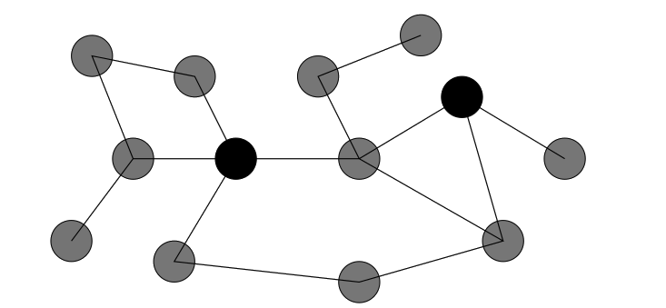
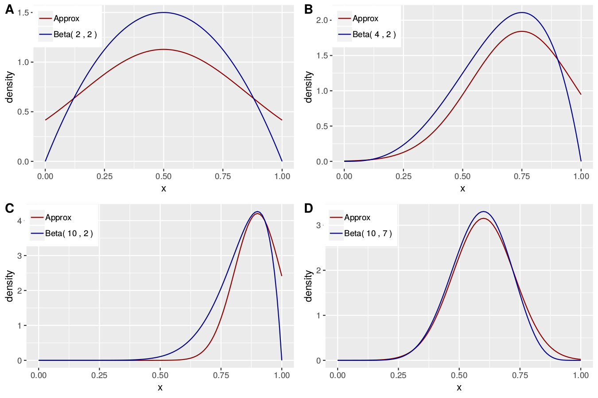
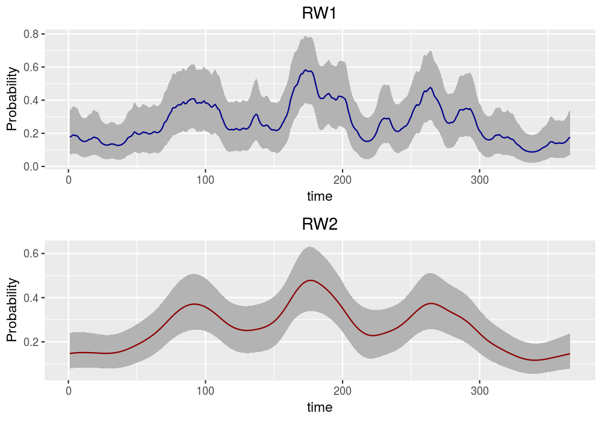
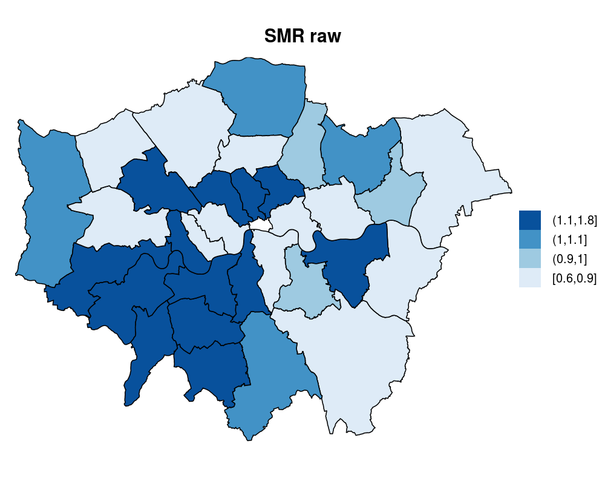
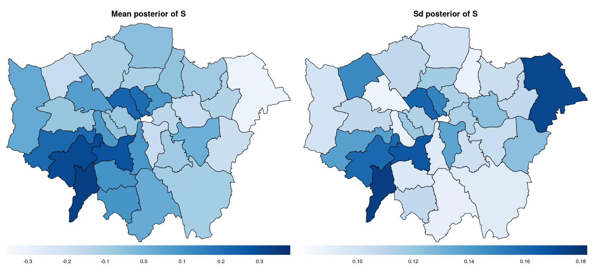
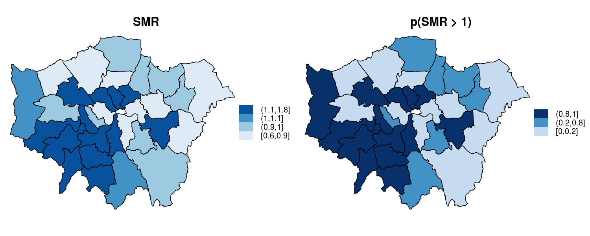

```{r echo = TRUE, include = FALSE}
  library(kableExtra)
library(INLA)
library(ggplot2)
# library(devtools)
# install_github("julianfaraway/brinla")
#library(brinla)
```

#Outline

## 1. Why INLA?

## 2. Elements to understand how INLA works

## 3. Putting all the pieces together: INLA

## 4. `R-INLA`

## 5. Model Selection

## 6. Examples
## 7. References

---
class: center, middle, animated, rotateInUpRight, inverse 

# 1. Why INLA?


---
# INLA as an alternative to MCMC

- MCMC is an asymptotically exact method whereas INLA is an .hlb[approximation]. Their error are frequently very similar, as has been shown in many simulation studies.

--

- INLA is a .hlb[fast alternative] to MCMC for the general class of latent Gaussian models (LGMs). Many familiar models can be re-cast to look like LGMs:
  - .hlb[generalized linear models], .hlb[generalized additive models], smoothing spline models, 
  - state space models, semi-parametric regression, .hlb[random walk (first and second order)] models, longitudinal data models,
  - .hlb[spatial and spatiotemporal] models, log-Gaussian Cox processes and geostatistical and geoadditive models., etc.
--

- To understand INLA, we need to be familiar with:
  - Latent Gaussian models
  - Gaussian Markov Random Fields (GMRFs)
  - Laplace approximations
  
  
  
---

class: inverse, center, middle, animated, slideInLeft

# 2. Elements to understand how INLA works

---

# Latent Gaussian model

## Level 1 : likelihood
The first stage is formed by the .hlb[conditionally independent likelihood] function of data coming from a certain exponential family distribution:

$$p(\boldsymbol{y} \mid \boldsymbol{\theta}, \boldsymbol{\psi}_1) = \prod_{i=1}^{n} p(y_i \mid \eta_i(\boldsymbol{\theta}),\boldsymbol{\psi}_1)$$
- $\boldsymbol{y} = (y_1,\ldots,y_{n})^T$ is the response vector, $\boldsymbol{\theta} = (\theta_1,\ldots,\theta_n)^T$ is the .hlb[latent field],
- $\boldsymbol{\psi}_1$ is the hyperparameter vector of the exponential family distribution and
- $\eta_i(\boldsymbol{\theta})$ is the $i$-th linear predictor that connects the data to the latent field.
	
Indeed each $\eta_i$ can take a more general additive form:
  $$\eta_i  = \beta_0 + \sum_{j=1}^{J}\beta_k x_{ij} + \sum_{k=1}^{K}f^{(k)}(z_{ik})$$
		
---

# Latent Gaussian model

## Level 2: latent Gaussian field
- The second stage is formed by the .hlb[latent Gaussian field], where we attribute a Gaussian distribution with mean $\boldsymbol{\mu}$ and precision matrix $Q(\boldsymbol{\psi}_2)$ to the latent field $\boldsymbol{\theta}$ conditioned on the hyperparameters $\boldsymbol{\psi}_2$, that is:
$$ \boldsymbol{\theta} \mid \boldsymbol{\psi}_2 \sim \mathcal{N}(\boldsymbol{0},Q^{-1}(\boldsymbol{\psi}_2)) $$

- If we can assume conditional independence in $\boldsymbol{\theta}$, then this latent field is a .hlb[Gaussian Markov Random Field (GMRF)].

--

## Level 3: hyperparameters
- Finally, the third stage is formed by the .hlb[prior distribution] assigned to the hyperparameters:
$$\boldsymbol{\psi} = (\boldsymbol{\psi}_1,\boldsymbol{\psi}_2) \sim p(\boldsymbol{\psi})$$ 

---
# GLMM
- Breslow and Clayton (1993) present a dataset where they account for the proportion of seeds that germinated on each of 21 plates arranged according to a 2 by 2 factorial layout by seed and type of root extract. 

.left-column3[
The variables are:

  - **r**: number of germinated seeds per plate
  - **n**: number of total seeds per plate
  - **x1**: seed type (0: seed O. aegyptiaco 75; 1: seed O. aegyptiaco 73) 
  - **x2**: root extracted (0: bean; 1: cucumber) 
  - **plate**: indicator for the plate
This dataset is located in the package .hlb[INLA]
]
--
.right-column3[
```{r echo=FALSE}
  library(INLA)
  head(Seeds)
```
]
---
# Example: mixed-effects model
- We assume the counts follow a conditionally independent .hbl[Binomial likelihood] function:
$$y_{i} \mid \pi_i \sim \text{Binomial}(n_i,\pi_i),\ i=1,\ldots,21$$
--

- We account for linear effects on .hlb[covariates] $x1_i$ and $x2_i$ for each individual, as well as a .hlb[random effect] on the individual level, the plate $b_i$.

\begin{eqnarray}
\eta_{i}  & = & \text{logit}(\pi_{i}) = \beta_0 + \beta_1 x1_i + \beta_2 x2_i + b_i \\
\beta_j & \sim & \mathcal{N}(0, \tau_{\beta}^{-1}),\ \tau_{\beta}\text{ known},\ j=0,1,2 \\
b_i & \sim & \mathcal{N}(0, \tau_b^{-1}) \\ 
\end{eqnarray}

So, in this case, $\boldsymbol{\theta} = (\beta_0, \beta_1, \beta_2, b_1, ..., b_{21})$. A Gaussian prior is assigned for each element of the .hlb[latent field], so that $\boldsymbol{\theta} \mid \boldsymbol{\psi}$ is .hlb[Gaussian distributed].

--

- To assign the prior of $\boldsymbol{\psi} = (\tau_b)$:
$$ \log(\tau_b) \sim \text{logGamma}(1, 5 \cdot 10^{-5}) \,$$

---
# Gaussian Markov Random Fields (GMRFs)

- A GMRF is a random vector following a .hlb[multivariate normal distribution] with Markov properties.
$$i \neq j, \ \theta_i \mid \theta_{ij},$$
being $-ij$ all elements other than $i$ and $j$.

--

- Rue et al. (2009) showed how .hbl[conditional independence properties] are encoded in the precision matrix, and how this can be exploited to improve computation involving these matrices. 
$$i \neq j, \ \theta_i \perp \theta_j \mid \theta_{ij},$$
$$\theta_i \perp \theta_j \mid \boldsymbol{\theta}_{ij} \leftrightarrow \boldsymbol{Q}_{ij} = 0$$
--

- This Markov assumption in the GMRF results in a .hlb[sparse precision matrix]. This sparseness aids extremely fast computation.

---
# The pairwise Markov property
## The two black nodes are conditionally independent given the gray nodes

.center[]


---
# Example: precision matrix in AR1
```{r echo = FALSE}
N = 5
rho = 0.95
Q = matrix(0, N, N)
diag(Q) = 1+rho^2
for (i in 1:(N-1)) {
  Q[i, i+1] = -rho
  Q[i+1, i] = -rho
}
```
.left-column2[
## Covariance matrix $\huge (\boldsymbol{\Sigma})$

```{r echo = FALSE}
  kable(round(solve(Q),4))
```
]

.right-column2[
## Precision matrix $\huge (\boldsymbol{Q})$
```{r echo = FALSE}
  kable(Q)
```
]

.center[
]
---
# Laplace approximations
- .hlb[The Laplace approximation] is used to estimate any distribution $p(\theta)$ with a normal distribution.

--

- It uses the first three terms (quadratic function) .hlb[Taylor series expansion] around the mode $\theta^*$ of a function to approximate its log.

--

- Using the approximation, $p(\theta)$ can be approximated using a .hlb[Gaussian distribution] with mean the mode $\theta^*$ and variance the Fisher information, $\frac{-1}{\frac{d^2 \log(p(\theta^*))}{d \theta^2}}$.

$$p(\theta) \approx \mathcal{N} \left(\theta^*, \frac{-1}{\frac{d^2 \log(p(\theta^*))}{d \theta^2}} \right)$$

--

- It can be easily expanded to the multivariate case.

---
# Example: approximating the beta distribution

.center[
]


---
class: inverse, center, middle, animated, bounceInDown

# 3. Putting all the pieces together: INLA


---
# INLA: Aim

## Marginals of the latent field and hyperparameters
$${p(\theta_i \mid \boldsymbol{y})} =  \int {p(\theta_i \mid \boldsymbol{\psi}, \boldsymbol{y})} \cdot {p (\boldsymbol{\psi} \mid \boldsymbol{y})} d \boldsymbol{\psi}\,\,, \ i=1, \ldots, n$$
$$p(\psi_j \mid \boldsymbol{y}) = \int{p(\boldsymbol{\psi} \mid \boldsymbol{y})}  d \boldsymbol{\psi}_{-j}\,, \ j=1, \ldots, m$$

- As a result, we have to numerically approximate:

	1. The .hlb[joint posterior distribution of the hyperparmeters] ${p(\boldsymbol{\psi} \mid \boldsymbol{y})}$, needed to calculate the posterior hyperparameters marginals $p(\psi_j \mid \boldsymbol{y})$, and the .hbl[posterior marginals of the latent field] $p(\theta_i \mid  \boldsymbol{y})$.
	
	2. The .hlb[marginals of the full conditional distribution] of $\boldsymbol{\theta}$, ${p(\theta_i \mid \boldsymbol{\psi}, \boldsymbol{y})}$, needed to compute the posterior marginals of the latent field $p(\theta_i \mid \boldsymbol{y})$.

---
# Hyperparameters: joint posterior distribution
- The approximation is computed as follows

$$\tilde{p}(\boldsymbol{\psi} \mid \boldsymbol{y}) := \frac{p(\boldsymbol{\theta},\boldsymbol{\psi}| \boldsymbol{y})}{p_G(\boldsymbol{\theta} \mid \boldsymbol{\psi}, \boldsymbol{y})}\bigg | _{\boldsymbol{\theta}=\boldsymbol{\theta}^*(\boldsymbol{\psi})}\,\,,$$	

- where:
  - $p_G(\boldsymbol{\theta} \mid \boldsymbol{\psi}, \boldsymbol{y})$ is the Gaussian approximation to the full conditional of $\boldsymbol{\theta}$, $p(\boldsymbol{\theta} \mid \boldsymbol{\psi}, \boldsymbol{y})$ given by the .hlb[Laplace method], and,
  
  - $\boldsymbol{\theta}^*(\boldsymbol{\psi})$ is the mode of the full conditional of $\boldsymbol{\theta}$ for a given $\boldsymbol{\psi}$. 

	- Note: this approximation is exact if $p(\boldsymbol{\theta}\mid \boldsymbol{y}, \boldsymbol{\psi})$ is Gaussian.

---
# Full posterior marginals for the latent field

### .hlb[Gaussian approximation] 
- Conditional posterior distributions ${p(\theta_i \mid \boldsymbol{\psi}, \boldsymbol{y})}$ are approximated directly as the marginals from $p_G(\boldsymbol{\theta} \mid \boldsymbol{\psi}, \boldsymbol{y})$.
- It is the .hlbred[fastest to compute] but with possible .hlbred[errors] in the location of the posterior mean. 

--
	
### .hlb[Laplace approximation] 
- The vector $\boldsymbol{\theta}$ is rewriten as $\boldsymbol{\theta}=(\theta_i, \boldsymbol{\theta}_{-i})$, and the Laplace approximation is used for each element of the latent field 
	$$\tilde{p}(\theta_i \mid \boldsymbol{\psi}, \boldsymbol{y}) := \frac{p(\boldsymbol{\theta},\boldsymbol{\psi}| \boldsymbol{y})}{p_{LG}(\boldsymbol{\theta}_{-i} \mid \theta_i ,\boldsymbol{\psi}, \boldsymbol{y})}\bigg |_{\boldsymbol{\theta}_{-i}=\boldsymbol{\theta}_{-i}^*(\theta_i, \boldsymbol{\psi})}\,\,,$$
	where $p_{LG}(\boldsymbol{\theta}_{-i} \mid \theta_i ,\boldsymbol{\psi}, \boldsymbol{y})$ is the Laplace Gaussian approximation to $p(\boldsymbol{\theta}_{-i} \mid \theta_i ,\boldsymbol{\psi}, \boldsymbol{y})$ and $\boldsymbol{\theta}_{-i}$ is its mode.
	
- The .hlbred[most accurate] but .hlbred[time consuming]. 

---


# Full posterior marginals for the latent field
### .hlb[Simplified Laplace approximation]

- Based on a Taylor's series expansion of third order.
- .hlbred[Fast to compute] and usually .hlbred[accurate enough].

---

# Final step: integration
- The INLA algorithm uses Newton-like methods to explore the joint posterior distribution for the hyperparameters $\tilde{p}(\boldsymbol{\psi}|\boldsymbol{y})$ to find .hlb[suitable points] for the numerical integration.

- Posterior marginals for the .hlb[latent variables] $\tilde{p}(\theta_i|\boldsymbol{y})$ are then computed via numerical integration as: 
  $$\tilde{p}(\theta_i \mid \boldsymbol{y}) = \int \tilde{p}(\theta_i \mid \boldsymbol{\psi},\boldsymbol{y}) \tilde{p}(\boldsymbol{\psi} \mid \boldsymbol{y}) \text{d}\boldsymbol{\psi} \approx \sum_{k=1}^{K} \tilde{p}(\theta_i \mid \boldsymbol{\psi}^{(k)},\boldsymbol{y}) \tilde{p}(\boldsymbol{\psi}^{(k)} \mid \boldsymbol{y})\Delta_k$$ 

--

- Posterior marginals for the .hlb[hyperparameters] $\psi_j$ are approximated using the integrations points previously constructed.

<!-- - Choice of the integration points can be done by defining a grid of points covering the area where most of the mass of $\tilde{p}(\boldsymbol{\psi}|\boldsymbol{y})$ is located or laying out a small amount of points in a $m$-dimensional space in order to estimate the curvature of  $\tilde{p}(\boldsymbol{\psi}|\boldsymbol{y})$. -->
---
class: inverse, center, middle, animated, bounceInDown


# 4. R-INLA

---
# Data
.left-column2[
</br>
```{r echo = FALSE}
  set.seed(100) #Fix the seed
n <- 100 #Number of data
sigma <- 0.1 #standard deviation
beta.0 <- 2 #Parameter
beta.1 <- 0.5 #Parameter

#Covariate
x <- runif(n)

#Mean
mu <- beta.0 + beta.1*x

#Response variable
y <- rnorm(n,mu,sigma)

#We create the data.frame
data <- data.frame(y = y, x = x, id = seq(1:n))
head(data)
```
]

.right-column2[
```{r echo = FALSE}
  ggplot(data) +
    geom_point(aes(x = x, y = y))
```
]

---
# Fitting the model using `R-INLA`

## Defining the formula
```{r}
formula <- y ~ 1 + x # 1 is refered to the intercept term
formula <- y ~ 1 + f(x, model = "linear")

```

## Calling `R-INLA`

```{r}
model1 <- inla(formula, 
               family       = 'gaussian', 
               data         = data,
               control.inla = list(strategy = 'simplified.laplace'))

```
---
# Posterior distributions

## .hlb[Posterior distribution of the parameters]

</br>

```{r echo = FALSE}
  kable(round(model1$summary.fixed, 4))
```

## .hlb[Posterior distributions of the hyperparameters]
</br>


```{r echo = FALSE}
  kable(round(model1$summary.hyperpar, 4))
```

---
# Families
```{r}
  inla.list.models(section = "likelihood")
```

---
# Latent effects
```{r}
  inla.list.models(section = "latent")
```

---

# Hyperpriors
```{r}
  inla.list.models(section = "prior")
```

---

class: inverse, center, middle, animated, rotateInUpLeft


# 5. Model Selection

---
# Model selection scores in `R-INLA`
- When use different covariates and random effects, we need some measures to select the best model:
  - .hlb[DIC]: deviance information criteria
		$$DIC  = 2*E(D(\boldsymbol{\theta})) - 						D(E(\boldsymbol{\theta}))$$
		
	- .hlb[WAIC]: within-sample predictive score
		$$WAIC  = \sum_{i} var_{post}(log( p(y_i|\boldsymbol{\theta})))$$
		
	- .hlb[LCPO]: leave-one-out cross-validation score
	  $$CPO_i = p(y_i \mid y_{-i})$$
		
	  $$LCPO  = - \overline{\log(CPO_i) }$$ 

---
class: inverse, center, middle, animated, rotateInDownRight


# 6. Examples

---
# GLMM
- Breslow and Clayton (1993) present a dataset where they account for the proportion of seeds that germinated on each of 21 plates arranged according to a 2 by 2 factorial layout by seed and type of root extract. 

.left-column3[
The variables are:

  - **r**: number of germinated seeds per plate
  - **n**: number of total seeds per plate
  - **x1**: seed type (0: seed O. aegyptiaco 75; 1: seed O. aegyptiaco 73) 
  - **x2**: root extracted (0:bean; 1:cucumber); 
  - **plate**: indicator for the plate
This dataset is located in the package .hlb[INLA]
]
--
.right-column3[
```{r echo=FALSE}
  library(INLA)
  head(Seeds)
```
]
---
# Example: mixed-effects model
- We assume the counts follow a conditionally independent .hbl[Binomial likelihood] function:
$$y_{i} \mid \pi_i \sim \text{Binomial}(n_i, \pi_i),\ i=1,\ldots,21$$
--

- We account for linear effects on .hlb[covariates] $x1_i$ and $x2_i$ for each individual, as well as a .hlb[random effect] on the individual level, the plate $b_i$.

\begin{eqnarray}
\eta_{i} & = & \text{logit}(\pi_{i}) = \beta_0 + \beta_1 x1_i + \beta_2 x2_i + b_i \\
\beta_j & \sim & \mathcal{N}(0, \tau_{\beta}^{-1}),\ \tau_{\beta}\text{ known},\ j=0,1,2 \\
b_i & \sim & \mathcal{N}(0, \tau_b^{-1}) \\ 
\end{eqnarray}

So, in this case, $\boldsymbol{\theta} = (\beta_0, \beta_1, \beta_2, b_1, ..., b_{21})$. A Gaussian prior is assigned for each element of the .hlb[latent field], so that $\boldsymbol{\theta} \mid \boldsymbol{\psi}$ is .hlb[Gaussian distributed].

--

- To assing the prior of $\boldsymbol{\psi} = (\tau_b)$:
$$ \log(\tau_b) \sim \text{logGamma}(1, 5 \cdot 10^{-5}) \,$$


---
# Bayesian splines
- GLMM with independent random effect does not cover situations in which relationship between the response variable and the covariate is not linear.

--

- In INLA, we can do this by means of the .hlb[random walk] of order 1 and 2.
  - .hlb[First order Random Walk (RW1)] 
$$\Delta x_j = x_j - x_{j+1} \sim  \mathcal{N}\left(0, \sigma^2=\frac{1}{\tau}\right)$$

  - .hlb[Second order Random Walk (RW2)] $$\Delta^2x_i = x_{i} - 2x_{i+1} + x_{i+2} \sim  \mathcal{N}\left(0, \sigma^2=\frac{1}{\tau}\right)$$
  - The prior for the hyperparameter $\tau$ is reparametrized in terms of their logarithm:
		$$\log(\tau) \sim \text{logGamma}(1, 5 \cdot 10^{-5})\,\,.$$

---

# Smoothing time series of binomial data
.left-column3[
- The number of .hlb[occurrences of rainfall] over 1 mm in the Tokyo area for each calendar year during two years (1983-84) are registered. 

- It is of interest to estimate the underlying probability ${\pi_t}$ of rainfall for calendar day ${t}$ which is, a priori, assumed to change gradually over time. 

- For each day ${t = 1, ..., 366}$ of the year we have the number of days that rained ${y_t}$ and the number of days that were observed ${n_t}$.
]

.right-column3[

**Dataset**

```{r, echo = FALSE}
  data <- Tokyo
  head(data)
```


]
---
# Smoothing time series of binomial data. The model
- A conditionally independent .hlb[binomial likelihood] function:
    $$y_t \mid \pi_t \sim \text{Binomial}(n, \pi_t),\ t = 1, ..., 366 $$
with (usual) logit link function:
    $$\pi_t = \frac{\exp(\eta_t)}{1 + \exp(\eta_t)}$$

- We assume that (instead of a linear predictor), $\eta_t = f_t$, where $f_t$ follows a circular .hlb[random walk] of second order (RW2) model with precision $\tau$:
    $$\Delta^2f_i = f_i - 2 f_{i+1} + f_{i+2} \sim \mathcal{N}(0,\tau^{-1}).$$
The fact that we use a circular model here means that in this case $f_1$ is a neighbor of  $f_{366}$. So, in this case $\boldsymbol{\theta} = (f_1, ..., f_{366})$ and again $\boldsymbol{\theta}|\boldsymbol{\psi}$ is .hlb[Gaussian distributed].

- To assing the prior of $\boldsymbol{\psi} = (\tau)$:
    $$\log(\tau) \sim \text{logGamma}(1, 5 \cdot 10^{-5})\,\,.$$
		
---
# Posterior distribution of the probability

.center[
]

---

# Disease mapping
- Congdon (2007) study suicide mortality in 32 London boroughs (excluding the City of London) in the period 1989–1993 for male and female combined, using a disease mapping model and an ecological regression model.

.left-column4[
- The variables are:
  - **N**: which contains the name of boroughs
  - **O**: the number of observed suicides in the period under study
  - **E**: the number of expected cases of suicides (E), 
  - **x1**: an index of social deprivation, and 
  - **x2**: an index of social fragmentation (X2), which represents the lack of social connections and of sense of community.
]

.right-column4[
```{r echo = FALSE}
data <- readRDS("../data/london_suic/london_suicides.RDS")
head(data)
```
]
---

#Standarized Mortality Ratio (SMR): raw data

.center[
]

---
# The model

- A conditional independent .hlb[Poisson] likelihood function is assumed:
$$y_i \sim \text{Poisson}(\lambda_i), \ \ \lambda_i =E_i \rho_i, \ \ \log(\rho_i)=\eta_i \,\,, i=1, \ldots 32 \,\,$$
--

- We assume that $\eta_i=\beta_0 + u_i + v_i$, being $\boldsymbol{u}$ the .hlb[independent random effect] and $\boldsymbol{v}$ the .hlb[spatially structured random effect]:

$$u_i \sim \mathcal{N}\left(0, \tau_{\boldsymbol{u}}^{-1}\right), \  v_i \mid \boldsymbol{v}_{-i} \sim \mathcal{N} \left(\frac{1}{n_{i}} \sum_{i \sim j} v_j, \frac{1}{n_{i} \tau_{\boldsymbol{v}}}\right)\,\,.$$

In this case $\boldsymbol{\theta}=(v_1, \ldots, v_{32}, u_1, \ldots, u_{32})$, and $\boldsymbol{\theta} \mid \boldsymbol{\psi}$ is Gaussian distributed.

--

- .hlb[Hyperpriors] for $\tau_{\boldsymbol{u}}$ and $\tau_{\boldsymbol{v}}$ are reparametrized in terms of their logarithm:
$$\log(\tau_{\boldsymbol{v}}) \sim \text{logGamma}(1, 0.001)\,\,, \ \log(\tau_{\boldsymbol{u}}) \sim \text{logGamma}(1, 0.001)\,\,.$$
---

# Posterior distribution of the spatial effect

.center[
]

---
# Posterior distribution for the SMR and P(SMR > 1)
.center[
]

---
class: inverse, center, middle, animated, slideInLeft

# 7. References

---
# This material has been constructed based on:

- Blangiardo, M., & Cameletti, M. (2015). Spatial and spatio-temporal Bayesian models with R-INLA. John Wiley & Sons.

- Rue, H., & Held, L. (2005). Gaussian Markov random fields: theory and applications. Chapman and Hall/CRC.

- Rue, H., Martino, S.,  & Chopin, N. (2009). Approximate Bayesian inference for latent Gaussian models by using integrated nested Laplace approximations. Journal of the royal statistical society: Series b (statistical methodology), 71(2), 319-392.

- Wang, X., Ryan, Y. Y., & Faraway, J. J. (2018). Bayesian Regression Modeling with INLA. Chapman and Hall/CRC.

- <a href="https://haakonbakka.bitbucket.io/organisedtopics.html/" style="color:#FF0000;"> Tutorials by Haakon Bakka </a>

- <a href="https://www.precision-analytics.ca/blog/a-gentle-inla-tutorial/" style="color:#FF0000;"> A gentle INLA tutorial by Kathryn Morrison </a>

- <a href="https://becarioprecario.bitbucket.io/inla-gitbook/index.html" style="color:#FF0000;"> INLA book by Virgilio Gómez-Rúbio </a>

---
class: inverse, center, middle, animated, bounceInDown

# The End
