```{r echo = TRUE, include = FALSE}
  library(kableExtra)
library(INLA)
library(ggplot2)
# library(devtools)
# install_github("julianfaraway/brinla")
#library(brinla)
```
# Spatial statistics. Types of spatial data
.left-column6[

.hlb[Spatial statistics] is defined as the part of statistics which deal with spatial data and study spatial patterns. 

- .hlb[Lattice or areal data]: observations are taken at a finite number of sites whose whole constitutes the entire study region (discrete space), e.g. number of sick people by provinces.

- .hlb[Point pattern]: the interest is study the process which generates the points. e.g. distribution of trees in a mountain.

- .hlb[Geostatistical data]: consist on a collection of data in a fixed set locations over a continuous spatial field, e.g. amount of fish in the ocean or presence/absence of a plant in a country.
]

.right-column6[
<div style="margin-top:-30px;"> 
</div>

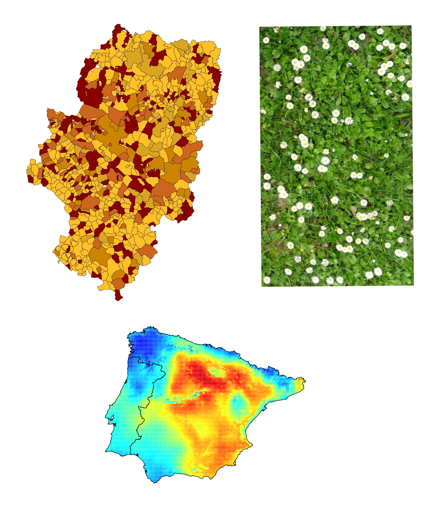

]
---

# A review
.left-column5[
- .hlb[Latent Gaussian models] are a particular case of .hlbred[Hierarchical Bayesian models]


- It works with .hlb[GMRFs]. .hlbred[Discrete space].


</br>

.center[
.hlb[1 dimension] 
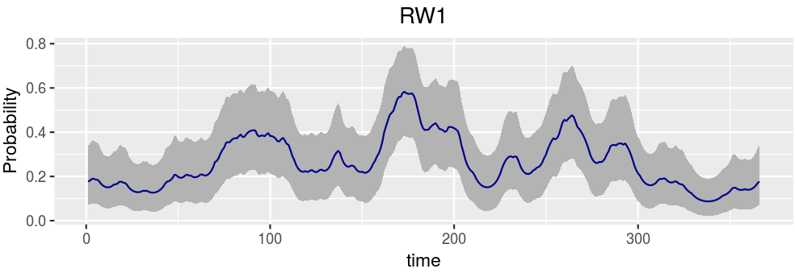]
]


.right-column5[
.center[
.hlb[2 dimension]
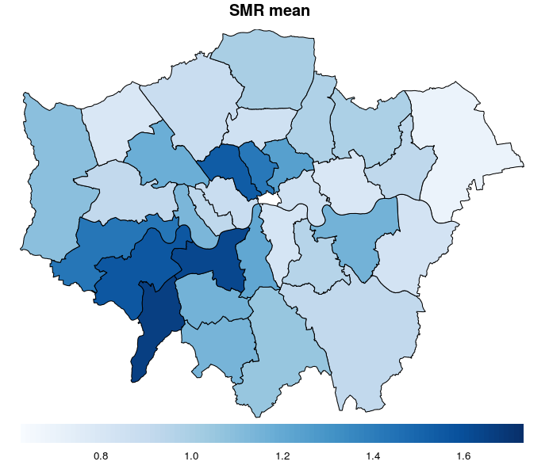]
]

---
# Discrete spaces
.left-column5[
- Sometimes, the assumption that the observations have been collected over .hlbred[discrete time] points have to be removed. 
  - In fishing data this asumption is not real. 

- The same happen in .hlb[space]. 
  - If we are studing the presence of a disease, or the temperature of an area, the locations where the phenomenon of interest is measured are not frequently allocated in a lattice. 
  
- Then, we are dealing with .hlb[continuous spaces] in 1D and 2D
]
.right-column5[
.center[
.hlb[*Fasciola* in Galicia]
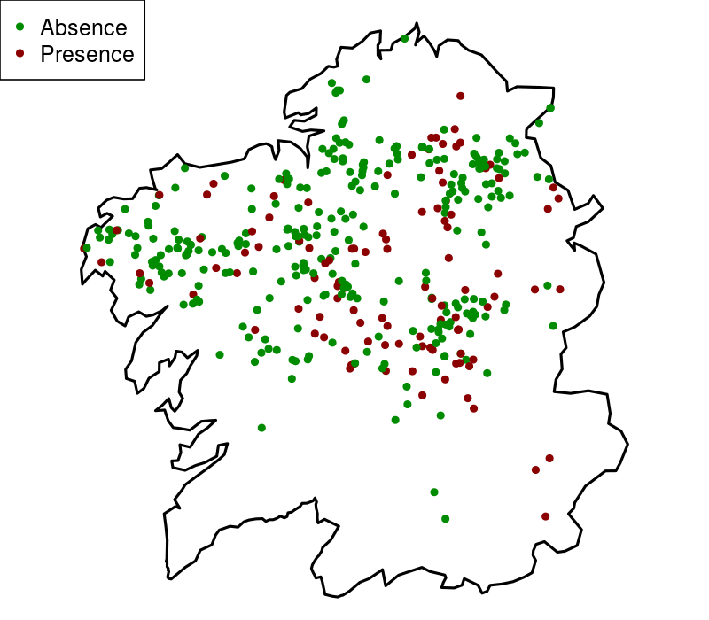]
]
---

# Outline

## 1. Geostatistics 

## 2. The problem: study the distribution of a parasite
## 3. The Stochastic Partial Differential Equation approach (SPDE)

## 4. Penalized complexity priors (PC-priors)

## 5. Fitting the model
## 6. Example in one dimension
## 7. Model convergence check

## 8. References


---
class: inverse, center, middle, animated, rotateInDownRight

# 1. Geostatistics
---

# Geostatistics. Basis

</br>

- #### Geostatistical models assume that the observations are correlated.

--

</br>

- #### They are base on the following principle

</br>
##.center[.hlb[Everything is related to everything else, but near things are more related than distant things]]

--

- #### So, two close locations tend to .hlb[co-vary] more than those far from each other.

---
# Let's do it a bit more formal 

- A random spatial effect $w(s)$ at a location $s \in \mathcal{D}$ can be considered as a .hlb[stochastic process] characterized by a spatial index $s$ which varies continuously in the fixed domain $\mathcal{D}$, where $\mathcal{D}$ is a fixed subset of $r$-dimensional Euclidean space. 

--

- The spatial process $w(s)$ is Gaussian if for any $n \geq 1$ and any set of sites $s = \{s_1, \ldots, s_n\}$, $w = \{w(s_1 ), \ldots, w(s_n)\}$ has a multivariate normal distribution with mean $\mu = E(w(s))$ and a structured covariance matrix $\Sigma$. Usually $\mu$ is assumed to be $\boldsymbol{0}$. In the literature, this process is widely known as a .hlb[Gaussian field (GF)]. 

--

- The key issue in spatial statistics is the covariance function $\mathcal{C}$, which determines the covariance between random variables in two different points. If $s_i$ and $s_j$ are two locations in space, then the .hlb[covariance function] is defined as 
$$\mathcal{C}(w(s_i), w(s_j)) = Cov(w(s_i), w(s_j))$$
- It defines the covariance matrix $\boldsymbol{\Sigma}$ of the GF. Each element of the matrix $\boldsymbol{\Sigma}_{ij}$ is defined as:

$$\boldsymbol{\Sigma}_{ij} = \mathcal{C}(w(s_i), w(s_j))$$

---
# Matérn

- .hlb[Stationarity]. We say that the GF is second-order stationary if $\mu(s) = \mu$ and $Cov(w(s), w(s + h)) = \mathcal{C}(h)$ for all $h \in \mathcal{R}$ such that $s$ and $s + h$ lie within $\mathcal{D}$. The covariance function in two different locations depends on the distance vector between these two locations. 

  - An example could be the spread of a pathogen in plants. If there is a road close to the crop,
maybe this pathogen could spread faster by the road in cars or trucks than in the crop, it would depend on the direction. 

--

- .hlb[Isotropy]. We say that the GF is isotropic if the covariance function depends only on the Euclidean distance between points, i.e., $Cov(w(s), w(s + h)) = C(||h||)$. 

  - For instance, if we think again in the spread of a pathogen in a crop, it would mean that the spread does
not depend on the direction, just on the distance. 

--


-  .hlb[Matérn correlation] function is so popular.
$$\mathcal{C}(||h||)  =  \sigma_{\boldsymbol{w}}^2 \left(\frac{\sqrt{8}}{\phi} ||h||\right) K_1 \left(\frac{\sqrt{8}}{\phi} ||h||\right)$$

---


# Matérn correlation function

.center[
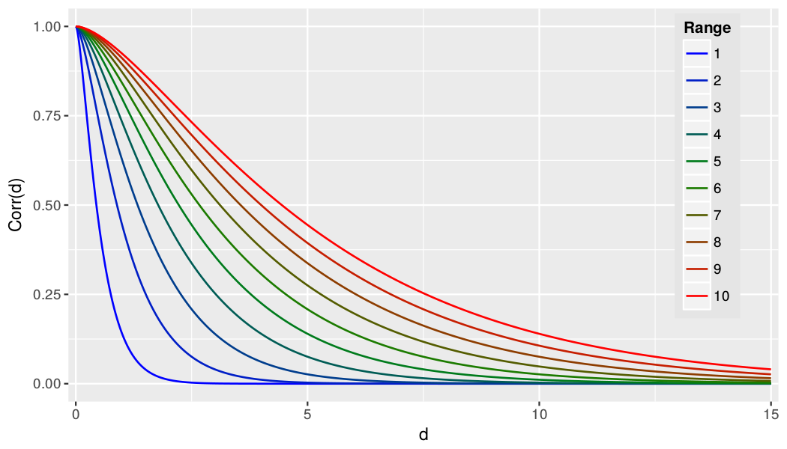]


<!-- # Spatial component -->

<!-- ## .hlb[Why is important to add the spatial component in our models?] -->

<!-- ### 1. Account for the .hlb[spatial autocorrelation] in our model -->

<!--   - .hlb[Better estimation] between the relationship of the response and explicative variables; -->
<!--   - .hlb[Better predictions]. -->

<!-- ### 2. When you add the spatial component as another variable in your model you can .hlb[map] it. -->

<!--   - The spatial effect indicate the .hlb[spatial intrinsic variability] of the data after the exclusion of the others explicative data, -->

<!--   - It could be a very useful tool as it could highlight different .hlb[spatial pattern] about a species distribution. -->


---
class: inverse, center, middle, animated, rotateInDownRight

# 2. The problem: study the distribution of a parasite

---
# *Fasciola* in Galicia

- We present a database which has information about the .hlb[presence/absence] of a parasite (*Fasciola*) affecting cattle. The dataset has information about 400 animals. 
Information on the study region and demographic information of each animal is available. Our objective is find the model that best explain the occurrence of this parasite. 

```{r echo = FALSE, eval = TRUE}
library(kableExtra)
data <- read.table("../data/galicia_fasc/data_galicia2.txt", 
                       header=TRUE)
kable(head(data))
```

---
# Response variable

.left-column8[
</br>
## .hlb[Presence/absence] of the parasite

- The boundaries are stored in an object of class `SpatialPolygons`.
]
.right-column8[
]


---


# Covariate

.left-column8[
</br>

## .hlb[Temperature]
- The covariate is stored in an object of class `raster`.
]
.right-column8[
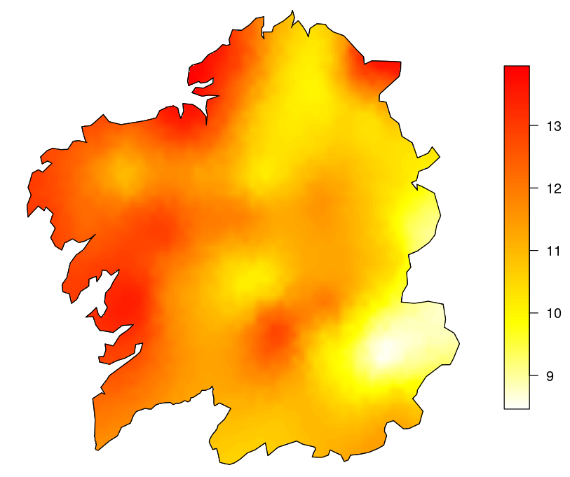]


---

# Latent Gaussian model (LGM)

## .center[.hlb[Level 1 : likelihood]]
$$p(\boldsymbol{y} \mid \boldsymbol{\theta}, \boldsymbol{\psi}_1) = \prod_{i=1}^{n} p(y_i \mid \eta_i(\boldsymbol{\theta}),\boldsymbol{\psi}_1)$$
</br>
## .center[.hlb[Level 2: latent Gaussian field]]
$$ \boldsymbol{\theta} \mid \boldsymbol{\psi}_2 \sim \mathcal{N}(\mu(\boldsymbol{\psi}_2),Q^{-1}(\boldsymbol{\psi}_2)) $$

</br>
## .center[.hlb[Level 3: hyperparameters]]
$$\boldsymbol{\psi} = (\boldsymbol{\psi}_1,\boldsymbol{\psi}_2) \sim p(\boldsymbol{\psi})$$ 

---

# Geostatistics in the context of LGMs

<font size="+2"> .hlb[Likelihood] </font> 

- A conditional independent .hlb[Bernoulli likelihood] function is assumed:

$$y_i \mid \pi_i \sim \text{Ber}(\pi_i), \   \eta_i = \text{logit} (\pi_i)=\beta_0 + \beta_1 Temp + w_i \,\,, i=1, \ldots 400 \,\,$$
--

<font size="+2"> .hlb[Latent Gaussian field] </font> 

$$\boldsymbol{w}  \sim  \mathcal{N}(0, \boldsymbol{\Sigma}(\sigma_{\boldsymbol{w}}, \phi)), \ \beta_j \sim \mathcal{N}(0, \tau = 0.001)$$
$\boldsymbol{\theta}=(\beta_0, \beta_1, w_1, \ldots, w_{400})$, and $\boldsymbol{\theta} \mid \boldsymbol{\psi}$ is Gaussian distributed.

- $\boldsymbol{w} \sim \mathcal{N}(\boldsymbol{0}, \boldsymbol{\Sigma(\sigma_{\boldsymbol{w}}, \phi)})$, i.e., the spatial effect is assumed to be a .hlb[continuous Gaussian field (GF)] with Matérn covariance structure, where:
- $\Sigma(\sigma_{\boldsymbol{w}}, \phi)$ is a .hlb[covariance matrix] depending on the distance between locations, $\sigma_{\boldsymbol{w}}$ is the .hlb[variance] of the spatial effect, and $\phi$ is the .hlb[range] of the spatial effect.


--
<font size="+2"> .hlb[Hyperparameters] </font>
$\boldsymbol{\psi} = (\sigma_{\boldsymbol{w}}, \phi)$
---

</br>

## .center[.hlbred[Problem: INLA can not fit continuous GFs]]

--

</br>

## .center[.hlb[Solution: approximate the continuous GFs using the Stochastic Partial Differential Equation approach (SPDE) ]]

---

class: inverse, center, middle, animated, rotateInDownRight

# 3. The Stochastic Partial Differential Equation approach (SPDE)

---
# The key idea
.left-column2[

### .center[.hlb[Likelihood]]
$$y_i \mid \pi_i \sim \text{Ber}(\pi_i) \,$$
$$\text{logit}(\pi_i) = \beta_0 + \beta_1 Temp + w_i \,$$


### .center[.hlb[Latent Gaussian field]]
$$\boldsymbol{\beta} \sim \mathcal{N(\boldsymbol{0}, \tau = 0.0001)}$$
$$\boldsymbol{w} \sim \mathcal{N}(\boldsymbol{0}, \boldsymbol{\Sigma(\sigma_{\boldsymbol{w}}, \phi)})$$

### .center[.hlb[Hyperparameters]]
$$p(\sigma_{\boldsymbol{w}}, \phi)$$
]

.right-column2[
### .center[.hlb[Likelihood]]
$$y_i \mid \pi_i \sim \text{Ber}(\pi_i) \,$$
$$\text{logit}(\pi_i) = \beta_0 + \beta_1 Temp + w_i \,$$


### .center[.hlb[Latent Gaussian field]]
$$\boldsymbol{\beta} \sim \mathcal{N}(\boldsymbol{0}, \tau = 0.0001)$$
$$\boldsymbol{w} \sim \mathcal{N}(\boldsymbol{0}, \boldsymbol{Q^{-1}(\sigma_{\boldsymbol{w}}, \phi)})$$

### .center[.hlb[Hyperparameters]]
$$p(\sigma_{\boldsymbol{w}}, \phi)$$
]

---

# How the approximation is conducted?

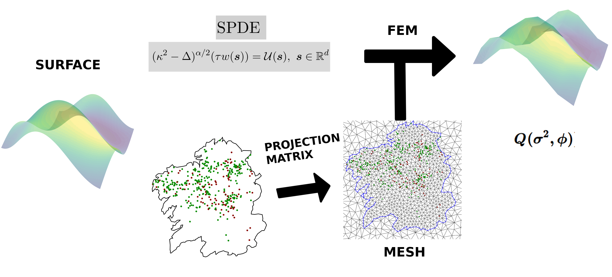


---

# FEM. General idea
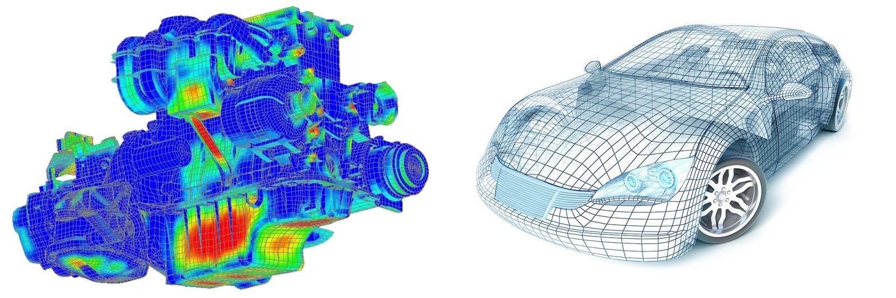

--- 

---

# The mesh

.left-column6[
- The mesh is created using a .hlb[Delaunay triangulation].

- The model is evaluated at the .hlb[intersecting nodes].

- We want triangles with .hlb[similar size] over the study area. .hlbred[Sample locations in mesh nodes not necessary].

- The greater is the number of triangles, the bigger is the computational cost.

- Too big triangles imply that part of the small scale variablity could be masked in the intrinsic variance of the process under study $\boldsymbol{y}$.
]

.right-column6[
.center[
.hlb[mesh 2D]
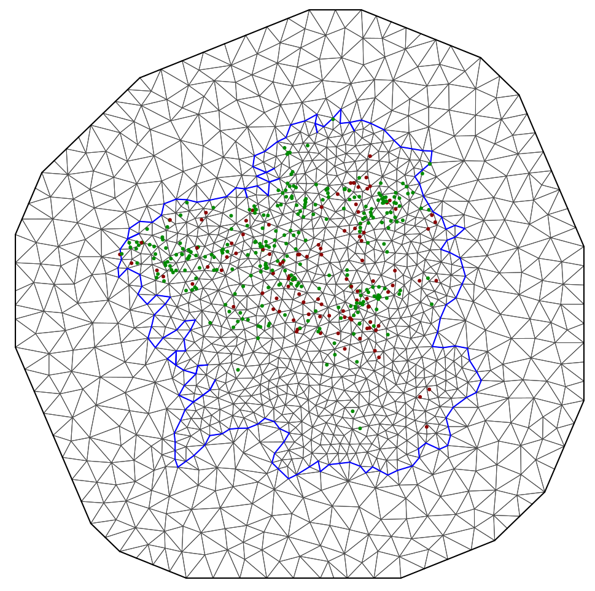]
]


---
# Mesh in `R-INLA`
.left-column4[
</br>

</br>

```{r echo = TRUE, eval = FALSE}
borinla <- inla.sp2segment(galicia_sp)
mesh <- 
  inla.mesh.2d(boundary     = borinla,
               max.edge     = ...,
               min.angle    = ...,
               cutoff       = ..., 
               offset       = ...) 

  
```

- <a href="https://haakonbakkagit.github.io/btopic114.html" style="color:#FF0000;"> How to do a bad mesh. By Haakon Bakka</a>
]

.right.column4[

]


---


# How the approximation is conducted?


---

# Connection between mesh and data: 1D

.left-column6[
```{r echo = TRUE, eval = FALSE}
mesh <- inla.mesh.2d(boundary = ...,  
                     max.edge = ...)

```


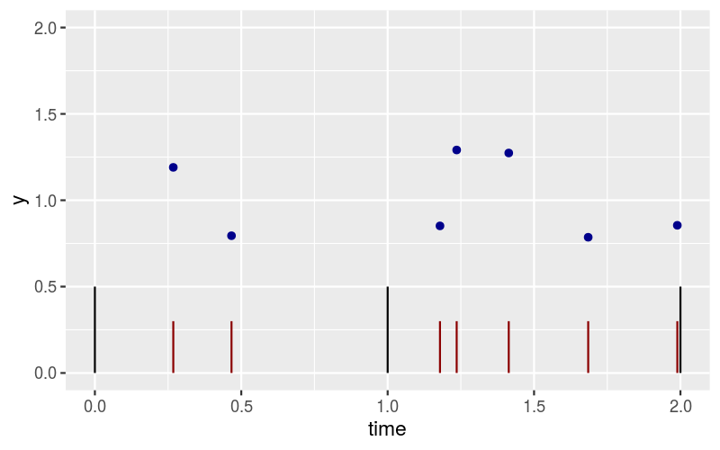]

.right-column6[

```{r echo = TRUE, eval = FALSE}
  inla.spde.make.A(mesh = ...,
                   loc  = ...)

```


```{r echo = FALSE}
  A <- readRDS("../rds/matrix_1D.rds")
  A <- round(as.matrix(A[1:7,]),4)
  colnames(A) <- c("knot 1", "knot 2", "knot 3")
  kable(A)
```
]


---
# Connection between mesh and data: 2D
.left-column8[

</br>

</br>

```{r echo = TRUE, eval = FALSE}
  A.est <- 
  inla.spde.make.A(mesh, 
      loc = cbind(data$x, data$y))
```
]
.right-column8[
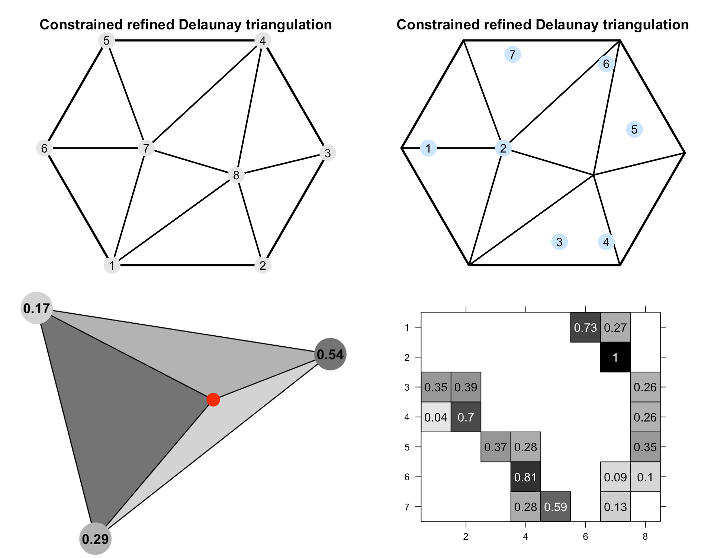]


---

# How the approximation is conducted?


---
# Solving SPDE using FEM: 1D and 2D
.center[
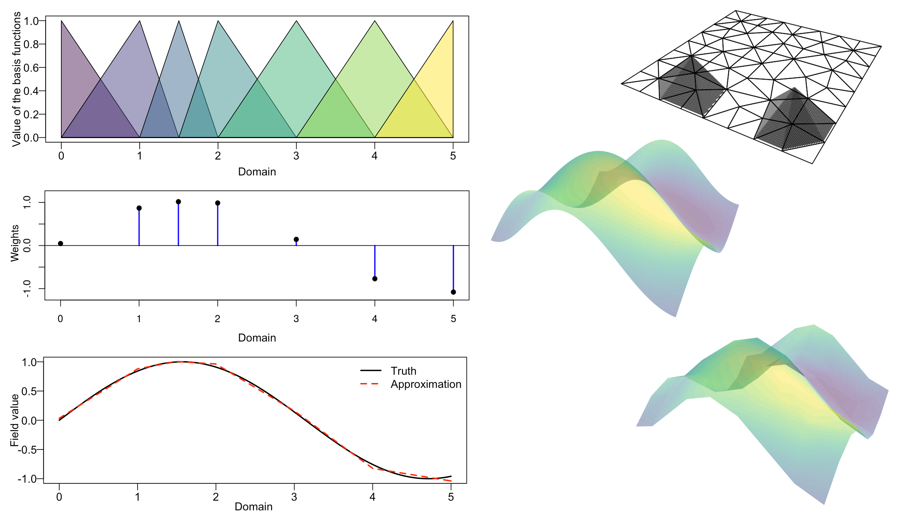]


---
# Defining SPDE

</br>

- In order to .hlb[define the SPDE], the following command have to be used:

</br>

```{r echo = TRUE, eval = FALSE}

spde <- inla.spde2.pcmatern(
  # Mesh 
  mesh = mesh, 
  # P(practic.range < range0) = 0.5
  prior.range = c(range0, 0.5),
  # P(sigma > 1) = 0.01
  prior.sigma = c(1, 0.01)) 
```

---
class: inverse, center, middle, animated, slideInLeft

# 4. Penalized complexity priors (PC-priors)

---
# Penalizing departure from the base model

- Simpson et al. (2017) propose priors that penalise departure from a base model and for this reason they are called .hlb[Penalized Complexity (PC) priors]. 

--

- The prior favours the base model unless evidence is provided against it, following the principle of parsimony. 

--

- Distance from the base model is measured using the .hlb[Kullback-Leibler] distance, and penalisation from the base model is done at a .hlb[constant rate on the distance]. 

--

- Finally, the PC prior is defined using .hlb[probability statements] on the model parameters in the appropriate scale.

---
# Hyperpriors for the standard deviation in an iid

- The .hlb[PC-prior for the precision] $\tau$ has density:

$$p(\tau) = \frac{\lambda}{2} \tau^{-3/2} \exp(-\lambda \tau^{-1/2}) \,, \ \tau > 0 \,,$$
where $$ \lambda = - \frac{ln(\alpha)}{u} \,,$$
and $(u, \alpha)$ are the parameters to this prior. The interpretation of $(u, \alpha)$ is that:

$$Prob(\sigma > u) = \alpha \,, \ u>0 \,, \ 0< \alpha < 1 \,.$$
--

- Functions `inla.pc.{d,p,q,r}.prec` allow us to .hlb[deal with this priors].

--

- If we want to plot the prior in terms of the .hlb[standard deviation] $\sigma$, remember that using function `inla.tmarginal` we can go from the $\tau$ parameter to $\sigma$ parameter.

---
# Hyperpriors for the standard deviation in an iid. $sigma = 1$

.center[
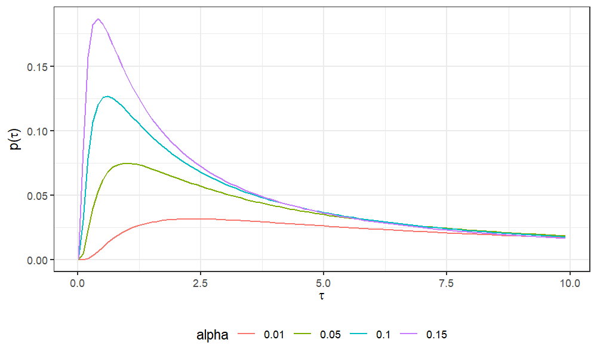]


---
# Spatial effect: priors
- The PC-prior for the .hlb[range] is defined in terms of $\phi_0$ and $p_1$ so that

$$Prob(\phi < \phi_0) = p_1$$
--

- The PC-prior for the .hlb[standard deviation] is defined in terms of $\sigma_0$ and $p_2$ so that

$$Prob(\sigma_{\boldsymbol{w}} > \sigma_0) = p_2$$ 
--

- In order to define the SPDE using PC-priors, the following command have to be used:
```{r eval = FALSE}
  spde <- inla.spde2.pcmatern(
  mesh = ..., 
  prior.range = c(phi0, p1),
  prior.sigma = c(sigma0, p2)) 
```

---

class: inverse, center, middle, animated, slideInLeft

# 5. Fitting the model

---

# Inla.stack for fitting the model

- ` inla.stack()` is useful for orgnizing data, covariates, indices and projector matrices. 

- In our case:
$$\eta^* = \boldsymbol{1} \beta_0 + \boldsymbol{1}\beta_1 sim + \boldsymbol{A} \boldsymbol{w} \,.$$


- The first term is the intercept, the second one the covariate, and the third one the spatial effect. Each term is represented as a .hlb[product of a projector matrix and an effect].


- `inla.stack()` function allows us to work with predictors that includes terms with different dimensions. 


- The three main `inla.stack()` arguments are:
  - A vector list with the data `data`.
  - A list of projector matrices (each related to one block effect, `A`)
  - A list of effects (`effects`).
  - Optionally (recommended), a label can be assigned to the data stack (using argument `tag`). 


---
# Inla.stack for estimation

</br>

```{r echo = TRUE, eval = FALSE}
stk.est <- inla.stack(data    = list(y = galicia$InfFasc),
                      A       = list(A.est, 1),
                      effects = list(spatial = 1:spde$n.spde,
                                     data.frame(beta0 = 1, 
                                                galicia)),
                      tag     = 'est')
```

---
# Time to call inla

```{r}
  formula.1 <- y ~ -1 + beta0 + Temperature + f(spatial, model = spde)
```

```{r echo = TRUE, eval = FALSE}

model.est <- inla(formula.1,
                  data              = inla.stack.data(stk.est), 
                  family            = "binomial" ,
                  control.compute   = list(dic              = TRUE,
                                           cpo              = TRUE, 
                                           waic             = TRUE, 
                                           return.marginals = TRUE), 
                  control.predictor = list(A       = inla.stack.A(stk.est), 
                                           compute = TRUE),
                  #control.inla=list(strategy = "laplace"),
                  num.threads       = 2,
                  verbose           = TRUE)
```

---
# Posterior predictive distribution

.center[
.hlb[*Fasciola* in Galicia]
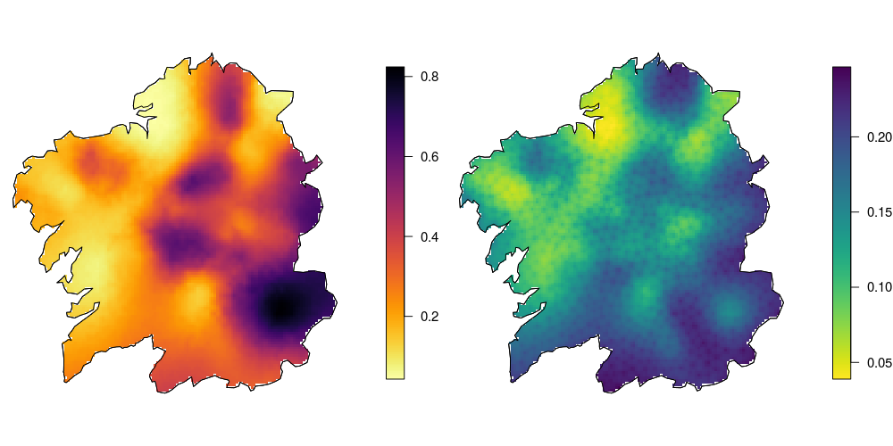]

---

class: inverse, center, middle, animated, rotateInDownRight

# 6. Example in one dimension

---
# Non equispaced samples in time

.center[
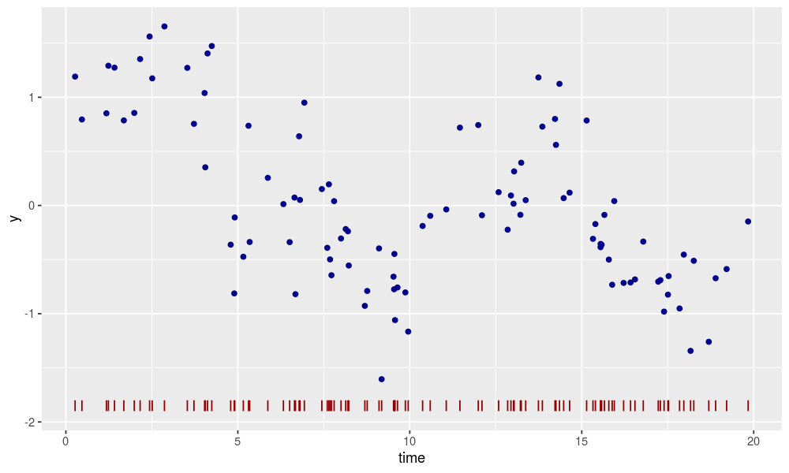]


---
# Possible model

.left-column2[
.center[
<font size="+3"> .hlb[Likelihood] </font> 

$$y_i \sim \mathcal{N}(\mu_i, \tau^{-1}) \,, i= 1, \ldots, n$$

$$\mu_i = u_i$$

<font size="+3"> .hlb[Latent Gaussian field] </font>

$$u_i - 2u_{i+1} + u_{i + 2} \sim  \mathcal{N}\left(0, \tau_{\boldsymbol{u}}^{-1} \right)$$


<font size="+3"> .hlb[Hyperparameters] </font>

$$\log(\tau), \log(\tau_{\boldsymbol{u}}) \sim \text{logGamma}(1, 5 \cdot 10^{-5})\,\,$$
]

### .hlbred[Problem: the time is continuous!]
]

.right.column2[
.center[
### .hlbred[Discretize]

<font size="+3"> .hlb[Likelihood] </font> 

$$y_i \sim \mathcal{N}(\mu_i, \tau^{-1}) \,, i= 1, \ldots, n$$

$$\mu_i = \sum_{j = 1}^J w_{ij} u_j, \ \  j \text{ are the index for the knots}$$

<font size="+3"> .hlb[Latent Gaussian field] </font>

$$u_j - 2u_{j+1} + u_{j + 2} \sim  \mathcal{N}\left(0, \tau_{\boldsymbol{u}}^{-1} \right)$$


<font size="+3"> .hlb[Hyperparameters] </font>

$$\log(\tau), \log(\tau_{\boldsymbol{u}}) \sim \text{logGamma}(1, 5 \cdot 10^{-5})\,\,$$

]
]


---

# We fit a random walk of second order

.center[
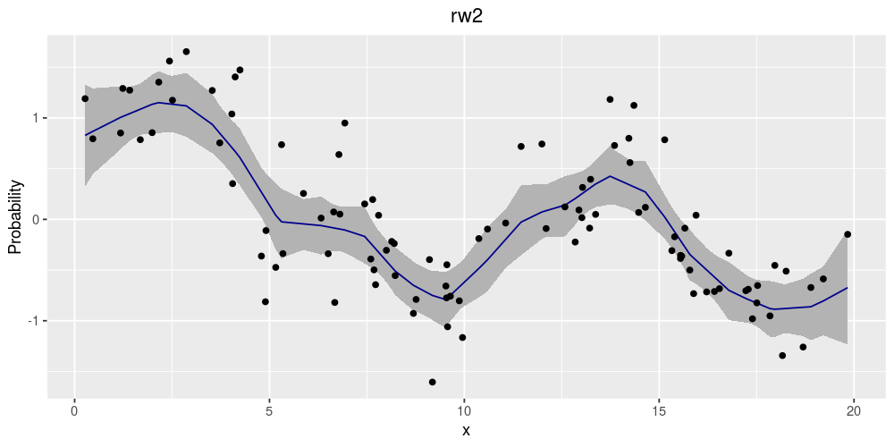]

---
# More knots, the better is the fit

.center[
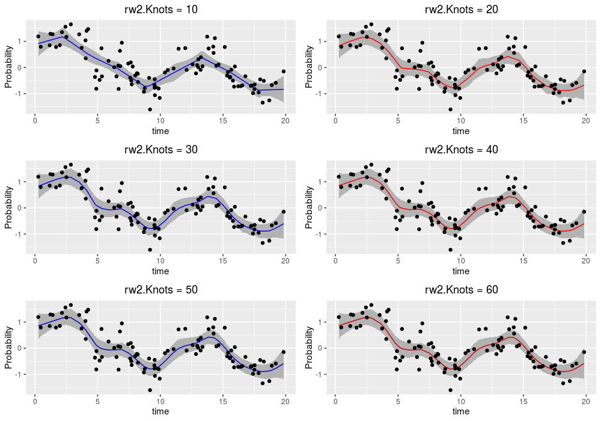]


---

class: center, middle, animated, rotateInUpRight, inverse 


# 7. Model convergence check

---

# Model convergence check

Here some useful things to look at to check a good convergence of INLA. Look at the output when call with .hlb[verbose=T].

- Find the .hlb[mode of the hyperparameters] in optimization process

  |x-x.old|=0.00179(pass) |f-f.old|=9.83e-005(pass)


- Eigenvalues: really high .hlb[eigenvalues of the Hessian] is a signal of a wrong result.

  Eigenvalues of the Hessian: .hlbred[352545481]
	  10.266339
	  0.738685


- .hlb[Corrected stdev] for $\boldsymbol{\psi}$ 

  Compute corrected stdev for theta[0]: negative 1.029899  positive 0.972300
  
  Compute corrected stdev for theta[1]: negative 1.024824  positive 0.955826
  
  Compute corrected stdev for theta[2]: .hlbred[negative 0.897012  positive 0.155335]

---

class: inverse, center, middle, animated, slideInRight

# 8. References

---

# This material has been constructed based on: 
- Barber, X., Conesa, D., Lladosa, S., & López-Quílez, A. (2016). Modelling the presence of disease under spatial misalignment using Bayesian latent Gaussian models. Geospatial health, 11:415.

- Blangiardo, M., & Cameletti, M. (2015). Spatial and spatio-temporal Bayesian models with R-INLA. John Wiley & Sons.

- Fuglstad, G. A., Simpson, D., Lindgren, F., & Rue, H. (2019). Constructing priors that penalize the complexity of Gaussian random fields. Journal of the American Statistical Association, 114(525), 445-452.


- <a href="https://www.r-inla.org/examples-tutorials" style="color:#FF0000;"> INLA tutorials </a>

- <a href="https://becarioprecario.bitbucket.io/inla-gitbook/index.html" style="color:#FF0000;"> INLA book by Virgilio Gómez-Rúbio </a>

- <a href="https://www.paulamoraga.com/book-geospatial/" style="color:#FF0000;"> INLA book by Paula Moraga </a>

- <href="https://becarioprecario.bitbucket.io/spde-gitbook/" style="color:#FF0000;"> SPDE book by Krainski et al. </a>


---
class: inverse, center, middle, animated, bounceInDown


# The End
